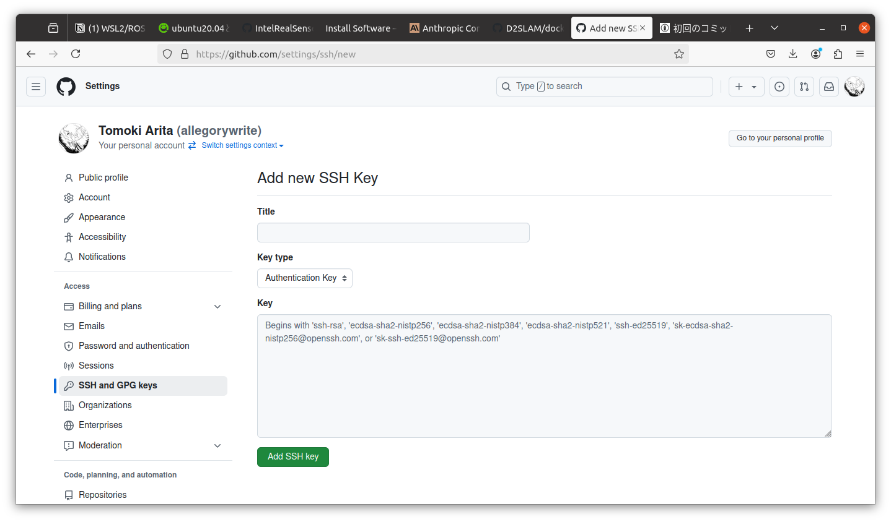

# ドローンのセットアップ

## Xavier NXのフラッシュ

jetsonのセットアップはdeveloper kitを使用すると容易に行うことができる。


Jetson Xavier NXのフラッシュには2通りある
1. pc(host)でmicroSDをフラッシュ(balenaEtcher / [Jetpack5.0.2](https://developer.nvidia.com/embedded/jetpack-sdk-502)) ⇒ xavierに刺してboot
2. pc(host)に[Jetpack SDK Manager](https://developer.nvidia.com/sdk-manager)を入れる ⇒ xavierをリカバリーモードで起動しusb経由でflash

基本2が安全だがmicroSDによってはうまくできないこともあるのでそのときは使い分ける。

Jetpack SDK Managerは以下コマンドで起動する
```bash
sdkmanager --archivedversions
```
以下のようにJetPack 5.0.2を選択してフラッシュを行う。


## Setup スクリプトの実行

Jetsonのフラッシュを行ったあと、Jetsonのterminal経由で各モジュールのセットアップを行うためのスクリプトをダウンロード、初期設定を行う。

```bash
mkdir $HOME/workspace
cd $HOME/workspace
git clone https://github.com/AgriSwarm/jetson_setup.git setup
cd setup
bash initial_setup.sh
```
出力されたsshの公開鍵をgithubに登録する。


```ssh -T git@github.com```で接続確認を行う。

セットアップスクリプトを実行する。

```bash
bash install_jetson.sh
```

## フライトコントローラのフラッシュ
以下操作はUbuntu PC上で行うことを推奨。フライトコントローラはHolybroのKakute H7 Miniを使用する。(他のフライトコントローラの場合はバイナリを変更する必要がある)

### 依存パッケージのインストール
```bash
sudo apt install dfu-util
```
[STMCubeProgrammer](https://www.st.com/en/development-tools/stm32cubeprog.html#get-software)をダウンロードし、インストールする。

### Ardupilotバイナリのダウンロード
```bash
cd $HOME/Downloads
wget https://firmware.ardupilot.org/Copter/stable/KakuteH7Mini-Nand/arducopter_with_bl.hex
```
[Ardupilotバイナリソース](https://firmware.ardupilot.org/Copter/stable/KakuteH7Mini-Nand/)

### フライトコントローラのフラッシュ
1. Kakute H7 Miniのブートボタンを押しながらUSBケーブルを接続
2. ```dfu-util --list```でデバイスが認識されていることを確認
3. (STMCubeProgrammer)Port:USB1 ⇒ connect ⇒ specify arducopter_with_bl.hex path ⇒ check run after programming ⇒ start programming

<!-- youtube: https://www.youtube.com/watch?v=utdvxuuekSE&t=308s -->
参考動画：
[](https://www.youtube.com/watch?v=utdvxuuekSE)